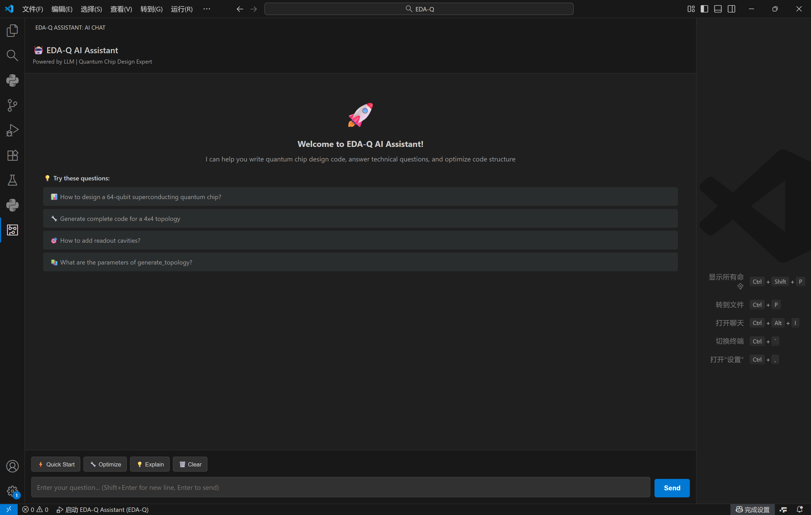

# EDA-Q v2.0.0

[](https://github.com/Q-transmon-xmon/EDA-Q)

EDA-Q is an advanced automated design tool for quantum chips (Simultaneous support for both superconducting and ion trap chip design is provided. For details on the ion trap chip design method, please refer to the README of ion_trap_chip), aimed at providing comprehensive support for the full design process of quantum chips in the quantum computing field. It integrates core features such as quantum chip topology design, equivalent circuit computation, GDS layout and routing, and simulation, helping researchers and engineers efficiently design and optimize  qubit chips.

## Directory

- [Background](#Background)
- [Installation](#Installation)
- [Key Project Leaders](#Key-Project-Leaders)
- [Ai Assistant](#Ai-Assistant)
- [Contribution Guide](#Contribution-Guide)
    - [Contributors](#Contributors)

## Background


With the rapid development of quantum computing technology, the design and optimization of quantum chips have become critical aspects of quantum hardware research. Among various approaches,  qubit technology has emerged as a leading solution for realizing quantum computation due to its high fidelity and scalability. However, the design process for  quantum chips is highly complex and challenging, as it involves numerous physical constraints, engineering limitations, and precise layout optimizations. These factors make traditional design methods inadequate to meet the demands of modern quantum chip development.


Although some design tools for quantum chips have been developed, they generally suffer from limitations such as a lack of comprehensive support for all design stages and insufficient automation in the design process. These tools fail to fully meet the demands of  quantum chip design, particularly in the context of large-scale quantum chips, where efficient and scalable solutions remain unavailable.


To address this, we have developed EDA-Q, an integrated platform that enables full-process automation for quantum chip design. By incorporating a range of core functionalities, EDA-Q facilitates the entire workflow, from topology design to simulation and verification, significantly improving design efficiency. Its objective is to provide a robust foundational design platform to support the engineering implementation of quantum computing hardware, thereby accelerating technological breakthroughs and the industrialization of quantum computing.

# Installation

We provide an installment-free version in **Releases** that allows you to run the UI launcher without environment configuration. If you need to use code for your quantum chip design, please refer to the installation documentation below.

## installation method

To simplify the installation process of the **EDA-Q** tool, we provide a pre-configured `environment.yml` file, which includes all the necessary dependencies and environment settings. Using this file, you can quickly create a Python environment that matches our development setup, ensuring the tool functions seamlessly.

## installation procedure:

1. **Install Anaconda or Miniconda**  
   Make sure that Anaconda or Miniconda is installed on your system, as they are the best tools for managing Python environments and dependencies. If not installed, please visit the [Anaconda official website](https://www.anaconda.com/products/distribution) or the [Miniconda official website](https://docs.conda.io/en/latest/miniconda.html) to download and install.

2. **Clone project warehouse**  
   Use Git to clone **EDA-Q** s project repository locally:
   ```bash+
   git clone https://github.com/Tianyan-QEDA/EDA-Q.git
   cd <EDA-Q Project directory>
   ```

3. **Create a Conda environment**  
   Create a new Conda environment from the environment.yml file by running the following command in the project directory:
   ```bash
   conda env create -f environment.yml
   ```

4. **Activation environment**  
   After creating the environment, use the following command to activate the newly created Conda environment:
   ```bash
   conda activate qeda_env
   ```

5. **Verification environment**  
   After activating the environment, you can verify that the installation was successful by running the following command:
   ```bash
   python -c "import api"
   ```
## Ai Assistant

## Key Project Leaders

[@Tiancaizhi](Tiancaizhi.github.io)
[@XiaohanEating](XiaohanEating.github.io)
[@BeautyGao](BeautyGao.github.io)
[@aknbg1thub](aknbg1thub.github.io)
[@ccccl-p](ccccl-p.github.io)
[@Celester7](Celester7.github.io)
[@Yuanbenzheng](Yuanbenzheng.github.io)

## Contribution Guide

[](https://github.com/Q-transmon-xmon/EDA-Q/pulls)

Submit a PR (https://github.com/Q-transmon-xmon/EDA-Q/pulls) request, and I will review it.

### Contributors

Thanks to all the contributors.

[@Institute of Physics, Chinese Academy of Sciences]() <br>
[@CIQTEK Co.,Ltd]() <br>
[@Shenzhen International Quantum Institute]() <br>
[@Zhejiang University]() <br>
